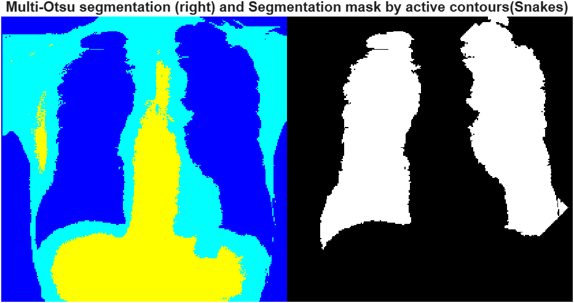
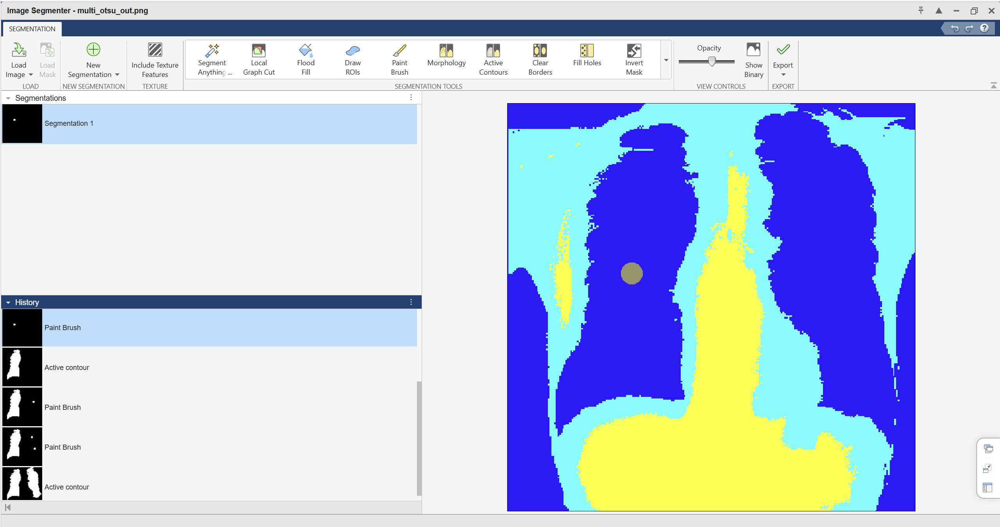
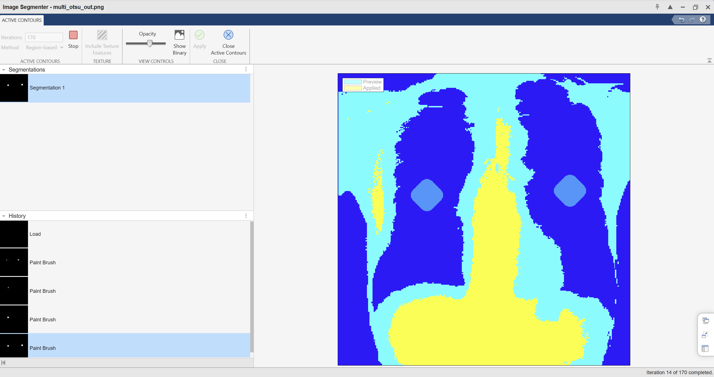
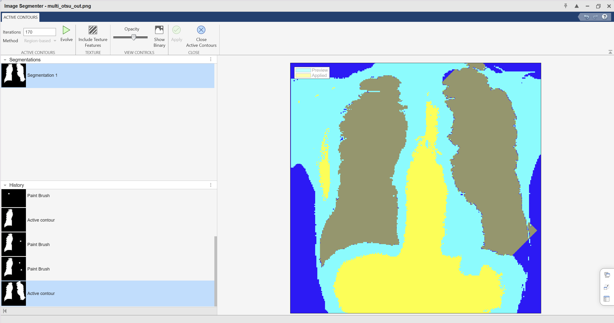

# Generate Segmentation Mask using MATLAB

Coarse-to-fine chest X-ray segmentation that pairs multi-threshold Otsu for initial region separation with an active contour (snake) refinement driven by user-marked ROI seeds.



## Repository contents
- `multi_otsu.m` - main script that runs multi-threshold Otsu and shows a montage of the input and segmented image.
- `images/` - sample input (`0.png`) and pipeline visuals (`multi_otsu.png`, `sim1.png`, `sim2.png`, `seg.png`, `RGB and seg.png`).
- `Improved implementation of Otsu and Snakes..pdf` - report describing the approach and improvements.

## Requirements
- MATLAB with Image Processing Toolbox (`multithresh`, `imquantize`, `label2rgb`, `imshowpair`, `activecontour`, `labeloverlay`).
- Optional: Image Segmenter app for brushing ROI seeds.

## Quick start
1. Run coarse Multi-Otsu segmentation:
   - Open this folder in MATLAB (`Generate-Segmentation-mask-using-MATLAB`).
   - Point `imread` in `multi_otsu.m` to your image (or use `images/0.png`).
   - Set `numThresh` for how many classes you want (e.g., 2 -> 3 classes, 3 -> 4 classes).
   - Run `multi_otsu` to view the initial colorized labels.
2. Choose the class you want to keep and build a seed mask from `labels` (see snippet below).
3. Refine with active contour (200 iterations):
   - Use the Image Segmenter/brush to mark the ROI like in `images/sim1.png` and `images/sim2.png`, or create a seed mask programmatically.
   - Run `activecontour` starting from that seed to tighten boundaries.
4. Save the refined mask and overlay it on the original.

## Example refinement snippet

```matlab
I = imread('0.png');
if size(I,3)==3, I = rgb2gray(I); end

% Coarse segmentation (same logic as multi_otsu.m)
numThresh = 2;
thresh = multithresh(im2double(I), numThresh);
labels = imquantize(im2double(I), thresh);

initMask = labels == 2;                % pick the class you want to refine
snakeMask = activecontour(I, initMask, 200, 'Chan-Vese');

imwrite(snakeMask, 'seg.png');         % matches images/seg.png
overlay = labeloverlay(I, snakeMask, 'Transparency', 0.5);
imwrite(overlay, 'RGB and seg.png');   % matches images/RGB and seg.png
```

## Visual snapshots
- Coarse Multi-Otsu output: 
- ROI seeding for snake:  
- Active contour result: 
- Final overlay: 

## Notes
- Multi-Otsu provides initial separation; the snake step tightens boundaries and removes noise using your brushed ROI.
- Adjust `numThresh`, seed mask, or iteration count based on anatomy and contrast.
- The PDF documents the reasoning and experiments behind this combined approach.
